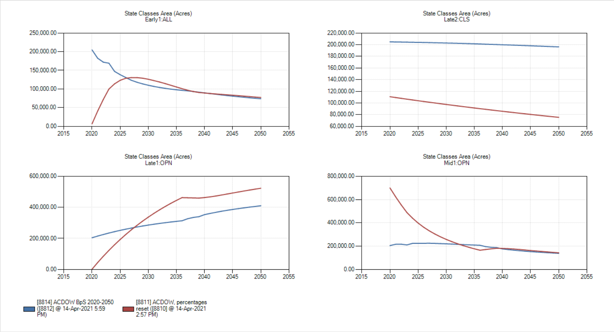
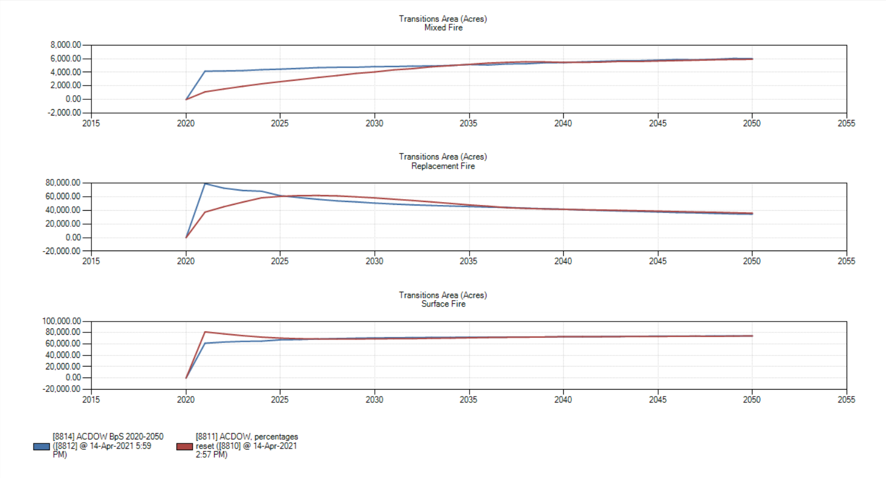
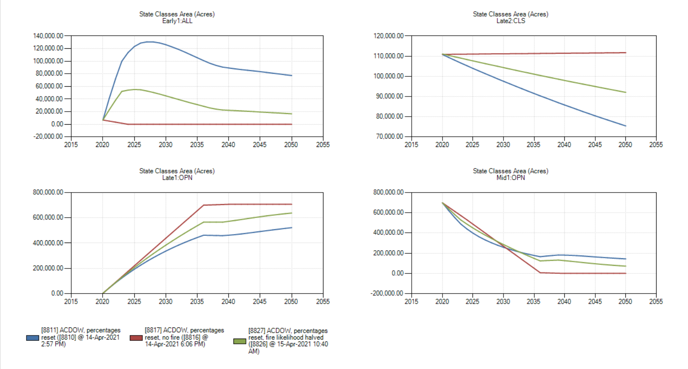
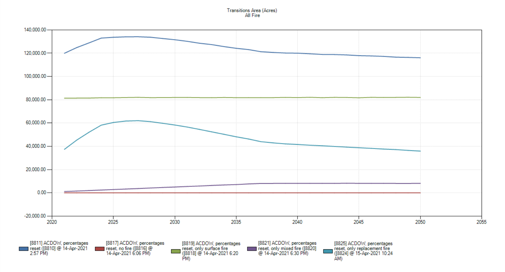
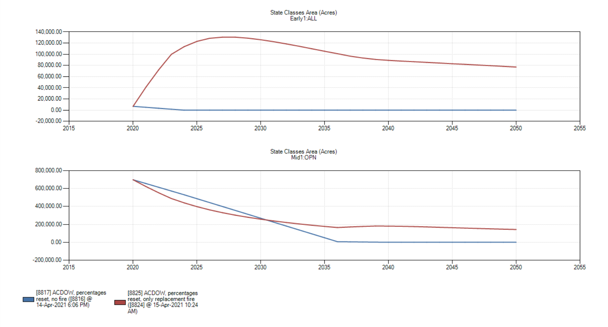

```{r setup, include=FALSE}
knitr::opts_chunk$set(echo = TRUE)
```

# Introduction

fill in later

\newpage

# Overview of the Wayne National Forest


The Wayne National Forest is comprised of three separate parcels of land in southeastern Ohio, spanning 12 counties in total, with 17 counties in the range of interest for holistic landscape  managment by forest service management. The Athens and Marietta units are jointly managed by the Athens Ranger District, while the more southerly Ironton unit is managed by the Ironton Ranger District. While the forest at large covers 875,000 acres of land, only a quarter of it is owned and managed by the Forest Service, leading to a number of issues with continuity of planning and ability to make and achieve conservation goals, as all policy objectives must be bought into by stakeholders and landowners before they can be pursued.


Before the entrenchment of colonists upon American soil, the landscape that would become the Wayne National Forest, and indeed, Ohio in general, was dominated by fire-adapted oak-hickory forests. At regular intervals, indigenous peoples set fires which killed the seedlings of other non-invasive species not characteristic of the landscape and providing oak the sun and space that it requires to get to the point in its growth when it can begin to withstand fires. In the absence of fires clearing the understory, faster-growing, shade tolerant maple seedlings are able to take hold and begin to shift the profile of the forest toward maple stands, which prevent oak from regenerating due to the closed-canopy nature of the system.

Modern fire suppression in the Wayne National Forest is fast and effective. Two fire departments service the forest area, and though human-generated fire starts are common, especially during spring and fall, they are prevented from taking hold, effectively reducing fire regeneration of the landscape to zero. At present, oak remains the dominant overstory species with a scattering of hickory, but stands are not regenerating, and instead are being replaced by mesophytic species like maple in a feedback loop (termed mesophication^1^) that has become characteristic of many forests in the eastern United States. Even where overstory transitions to maple are only partial or where oak stands have presisted, mid and understory invasives have caused the landscape to depart significantly from historic character. 

Realistically speaking, it is an unfeasible goal to return the Wayne National Forest to its precolonial state. Historical records of landscape character are incomplete, reconstructions of landscape will never be perfect, and the state of resource extraction and human land use, both past and present, in the region, as well as the checkered ownership make the idyll of a "return" impossible. 

\newpage

# Preliminary Work












/newpage

# Sources cited

1. Gregory J. Nowacki, Marc D. Abrams, The Demise of Fire and “Mesophication” of Forests in the Eastern United States, BioScience, Volume 58, Issue 2, February 2008, Pages 123–138, https://doi.org/10.1641/B580207

All graphs made in SyncroSim.