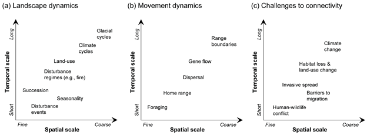
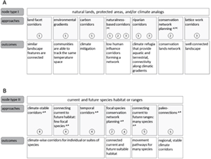

1. Hall, K.; Anantheraman, R.; Landau, V.; Clark, M.; et al. Circuitscape in Julia: Empowering Dynamic Approaches to Connectivity Assessment. Land 2021, 10, x.
    + Focuses on using Julia, a language which emphasizes parallel computing techniques to run connectivity and other landscape models more quickly, as the languages used by ecologists and the available technology to ecologists may not support the computing demands that the increasing amt of available spatial data needs to be usable in the conservation field
    + Circuitscape uses resistance grids as input; increasing dynamism 
  
_Works Cited (for Reference)_

* Zeller, K.A.; Lewsion, R.; Fletcher, R.J.; Tulbure, M.G.; Jennings, M.K. Understanding the importance of dynamic landscape connectivity. Land 2020, 9, 303, https://doi.org/10.3390/land9090303.
  + Cited below
*	Farley, S.S.; Dawson, A.; Goring, S.J.; Williams, J.W. Situating ecology as a big-data science: current advances, challenges, and solutions. Bioscience 2018, 68, 563-576, https://doi.org/10.1093/biosci/biy068.
    + Cited below
*	Fletcher, R.; Fortin, M.-J. Spatial Ecology and Conservation Modeling Springer, Cham: 2018; https://doi.org/10.1007/978-3-030-01989-1.
*	Runting, R.K.; Phinn, S.; Xie, Z.; Venter, O.; Watson, J.E.M. Opportunities for big data in conservation and sustainability. Nat. Commun. 2020, 11, 2003, https://doi.org/10.1038/s41467-020-15870-0.
    + Cited below
*	Gomes, C.; Dietterich, T.; Barrett, C.; Conrad, J.; Dilkina, B.; Ermon, S.; Fang, F.; Farnsworth, A.; Fern, A.; Fern, X., et al. Computational sustainability: Computing for a better world and a sustainable future. Commun. ACM 2019, 62, 56-65, https://doi.org/10.1145/3339399.
    + Cited below
*	Wood, K.A.; Stillman, R.A.; Hilton, G.M. Conservation in a changing world needs predictive models. Anim. Conserv. 2018, 21, 87-88, https://doi.org/https://doi.org/10.1111/acv.12371.
*	Keeley, A.T.H.; Ackerly, D.D.; Cameron, D.R.; Heller, N.E.; Huber, P.R.; Schloss, C.A.; Thorne, J.H.; Merenlender, A.M. New concepts, models, and assessments of climate-wise connectivity. Environ. Res. Lett. 2018, 13, 073002, https://doi.org/10.1088/1748-9326/aacb85.
    + Cited below
*	Zeller, K.A.; McGarigal, K.; Whiteley, A.R. Estimating landscape resistance to movement: a review. Landscape Ecol. 2012, 27, 777-797, https://doi.org/10.1007/s10980-012-9737-0.
*	McRae, B.H.; Dickson, B.G.; Keitt, T.H.; Shah, V.B. Using circuit theory to model connectivity in ecology, evolution, and conservation. Ecology 2008, 89, 2712-2724, https://doi.org/10.1890/07-1861.1.
    + Cited below
*	Dilts, T.E.; Weisberg, P.J.; Leitner, P.; Matocq, M.D.; Inman, R.D.; Nussear, K.E.; Esque, T.C. Multiscale connectivity and graph theory highlight critical areas for conservation under climate change. Ecol. Appl. 2016, 26, 1223-1237, https://doi.org/10.1890/15-0925.
*	Jennings, M.K.; Haeuser, E.; Foote, D.; Lewison, R.L.; Conlisk, E. Planning for dynamic connectivity: Operationalizing robust decision-making and prioritization across landscapes experiencing climate and land-use change. Land 2020, 9, 341, https://doi.org/10.3390/land9100341.
*	Leonard, P.B.; Sutherland, R.W.; Baldwin, R.F.; Fedak, D.A.; Carnes, R.G.; Montgomery, A.P. Landscape connectivity losses due to sea level rise and land use change. Anim. Conserv. 2017, 20, 80-90, https://doi.org/10.1111/acv.12289.
*	Schaffer-Smith, D.; Swenson, J.J.; Boveda-Penalba, A.J. Rapid conservation assessment for endangered species using habitat connectivity models. Environ. Conserv. 2016, 43, 221-230, https://doi.org/10.1017/s0376892915000405.
*	Howey, M.C.L. Multiple pathways across past landscapes: circuit theory as a complementary geospatial method to least cost path for modeling past movement. J. Archaeol. Sci. 2011, 38, 2523-2535, https://doi.org/10.1016/j.jas.2011.03.024.
*	Nissen, J.N. 2020. What scientists must know about hardware to write fast code (blog post, April 19, 2020).   Accessed November 12, 2020.  https://biojulia.net/post/hardware/.  

\  

2. Zeller, K.A.; Lewsion, R.; Fletcher, R.J.; Tulbure, M.G.; Jennings, M.K. Understanding the importance of dynamic landscape connectivity. Land 2020, 9, 303, https://doi.org/10.3390/land9090303.
    + addressing the problem that most connectivity models are static where landscapes are dynamic
    + Landscape connectivity is being used to combat the problems of habitat loss/fragmentation to try and understand how species are being affecting and how we can mitigate the deleterious effects; a population with some connectedness can maintain metapopulations, and increasing connectivity can be an intervention for isolated populations
    +	Google “patch colonization” and “metapopulation persistence metrics”
        +	patch colonization: when a species moves into an empty patch of land – this sub population may eventually die out, but if patch colonization continues at a replacement rate, the metapopulation will remain stable (https://www.bgu.ac.il/desert_agriculture/Popecology/PEtexts/PE-K.htm)
        +	metapopulation persistence metrics: ways to measure whether the metapopulation is stable despite patch extinctions due to patch recolonization and patch dispersal (https://doi.org/10.1371/journal.pcbi.1004251)
    +	Matrix: “the portion of the landscape that extends among identified habitat patches”
    +	Patches, corridors, and matrices are all part of a good connectivity model
    +	Gaps in landscape connectivity: factoring in dynamism due to temporal scale in terms of seasons, years, and decades
    +	increases in data availability and personal computational power have made dynamic connectivity more viable to integrate into connectivity models; the outstanding questions are “how much to put in” and “how to understand what we get out”
    +	Spatial prioritization concepts:
        +	complementarity: “identification of linkages that complement others”
            +	what does this mean?
        +	redundancy: making sure there are multiple linkages so that if one is lost, the landscape isn’t completely fucked up
        +	irreplaceability: how much redundancy there is for a landscape linkage; how much the connectivity would be impacted by removal of this particular linkage
        +	permanence: how resilient a linkage is to dynamism, how likely it is to remain stable throughout time
    +	Functional connectivity: ability of a specific species to move through a landscape

    +	Gene flow is a general measure for long-term connectivity
    +	A problem that dynamic connectivity needs to address is that structural connectivity changes a lot more predictably than functional connectivity, which can change very rapidly or over long periods of time
        +	phenomena such as temperature, weather, or human activity may cause fluxes in functional connectivity on a scale of hours to days
    +	seasonal connectivity especially relevant for migratory species whose functional connectivity differs strongly from season to season
        +	“Landscape dynamics may be represented using seasonal land use/land cover maps, while movement data may be subset to different seasons for analysis.”
    +	two main modeling strategies for addressing climate change are:
        +	functional assessments (often with a species of interest)
            +	create connectivity models for the future based on our ideas of how species will respond to certain types of change
        +	structural approaches
            +	focused on picking out which features will support connectivity no matter what kind of climate change happens/ways to use the environment to minimize the impact of climate change
    +	Functional connectivity prediction often looks at the future in discretized time steps, which has the problem of not providing a model for the flow and change of connectivity during the intervening blocks of time, which may cause connectivity underestimation and predictions of patch isolation greater than is experienced when the flow of species through time is accounted for
    +	structural approaches often look at where there might be habitats like the ones which may be damaged or destroyed under climate change – rather than looking at what a species might do, which is very uncertain by nature, it looks more at where a species might be moved so that it can persist even under climate change
    +	modeling considerations
        +	extent of habitat-shifting events
        +	severity of above
        +	time until landscape recovery
    +	“In cases where incorporating movement or landscape dynamics into connectivity planning and management is necessary, a number of strategies may facilitate the translation of models and assessments into action. As connectivity planning and implementation are often components of landscape-scale conservation planning efforts, many of the same reserve design principles that address dynamics, accommodate change, and prioritize actions can be applied (e.g., [92,93]). For example, when the dynamics of disturbance events (e.g., wildfire, flooding) affect landscape structure or animal movement, establishing redundancy in linkages [94] can allow for alternative movement routes if conditions in a linkage become temporarily unsuitable. For long-term shifts, considering complementarity in linkages, where key features of local or regional linkages are added to a network across multiple land units or linkages, can maximize efficacy and flexibility while establishing priorities to support dynamic connectivity. However, when those shifts put linkages at risk of being degraded or lost entirely as a result of permanent change, adjusting connectivity targets may be warranted. Furthermore, it may be necessary to identify irreplaceable linkages where minimizing the impacts of landscape dynamics that can lead to the degradation of habitat quality or connectivity value becomes a long-term management target. In addition to these prioritization strategies, evaluating worst-case scenarios [90] or thresholds associated with disturbance and change responses relative to different conservation actions and management options [93] can be critical to establishing networks that are sustainable both biologically and economically.”
    
\      

3. Farley, S.S.; Dawson, A.; Goring, S.J.; Williams, J.W. Situating ecology as a big-data science: current advances, challenges, and solutions. Bioscience 2018, 68, 563-576, https://doi.org/10.1093/biosci/biy068.
    +	Big Data
        +	data in excess of a person or field’s ability to analyze
        +	the “four V’s”: volume, variety, veracity, and velocity
    +	Sources of mass ecological data generation:
        +	remote sensors monitoring the earth (satellites, etc)
        +	the ability to join individual scientific work to the greater body of work
        +	long term ecological monitoring networks
        +	automated sensor networks that can be left in the field (such as cameras that take pictures when they sense movement)
        +	citizen science initiatives
    +	Because there are so many sources of data in the eco-sciences, variety and veracity are the biggest problems eco-data-scientists run into, with data collected in many different ways that may not all be of the same time and is thus hard to run meta-analyses on and difficulty of being sure that all data is accurate, given its heterogeneity
    +	ecological forecasting depends on closeness of model and data, and iterative looping, possibly self correcting, to improve and refine forecasts
    +	“Common examples in ecology include boosted regression trees, generalized linear models, and random forest models (e.g., Elith et al. 2006), but ML approaches also include more complex methods such as knowledge learning and analysis systems (Peters et al. 2014). Artificial neural networks, organized into layers of “neurons” or nodes, are the basis of “deep” ML and have become increasingly powerful as the number of nodes and layers increases.”
   
\  
    
4. Runting, R.K.; Phinn, S.; Xie, Z.; Venter, O.; Watson, J.E.M. Opportunities for big data in conservation and sustainability. Nat. Commun. 2020, 11, 2003, https://doi.org/10.1038/s41467-020-15870-0.
    + General overview of different projects groups and individuals are doing harnessing big data for environmental work.
   
\  
    
5. Gomes, C.; Dietterich, T.; Barrett, C.; Conrad, J.; Dilkina, B.; Ermon, S.; Fang, F.; Farnsworth, A.; Fern, A.; Fern, X., et al. Computational sustainability: Computing for a better world and a sustainable future. Commun. ACM 2019, 62, 56-65, https://doi.org/10.1145/3339399.
    +	Another article mostly listing work people are doing on conservation and big data, with an emphasis on problem-solving in ways that are universalizable and can solve multiple different types of problems using generalized computing
    +	Fern et al (look up) demonstrated Bayesian optimization algorithms to outperform UCB, because UCB is very sensitive to the exploration parameter set, which makes Bayesian optimization better at addressing greater varieties of data
    +	n-armed bandit models with a delay function can be used for things like developing an optimal charging policy for a lithium ion battery
   
\  
    
6. Keeley, A.T.H.; Ackerly, D.D.; Cameron, D.R.; Heller, N.E.; Huber, P.R.; Schloss, C.A.; Thorne, J.H.; Merenlender, A.M. New concepts, models, and assessments of climate-wise connectivity. Environ. Res. Lett. 2018, 13, 073002, https://doi.org/10.1088/1748-9326/aacb85.
    +	Generally really interesting article with a lot of ways that modeling can be applied to the problems of connectivity and climate change; worth a re-read.
    +	Addressing habitat connectivity, utility of wildlife corridors to combat fragmentation, and species resilience to climate change
    +	Range shifts related to climate change will move along temperature and moisture gradients, providing a template to map connectivity 
    +	climate velocity: “the speed at which a population would have to move to keep up with the changing climate on the landscape” in °C year−1/ °C km−1 (the ratio of rate of climate change and the spatial gradient)
    +	Low climate velocity areas support greater diversity of species, especially those with small ranges. 
        +	this suggests that rugged areas may be climate resilient because they allow species to move shorter distances in order to remain in suitable habitat as climate changes
        +	on the other hand, studies of montane biomes suggest that the paths between areas that currently support species and those that might support those same species in the climate-altered future cross over terrain which is extremely different and may be functionally impassible
        +	so for now it’s a wash?
    +	Genetic refuge theory apparently has some basis in paleoecology? Which is cool – the Pleistocene era suffered a warming event and we can do some movement tracing to see how species responded to that
    +	Macrorefugia vs microrefugia – basically large swaths of land on which a species can survive versus climactic pockets in an otherwise inhospitable climate in which species can survive in pocket communities; the latter is important to look at through the lense of connectivity
        +	microrefugia of the future, however, can only be identified by extremely granular climate data, to the point that they may require field sampling to be able to be picked out
    +	Types of microrefugia:
        +	stepping stones; facilitators of movement of a species, factored into climate corridor planning theory
        +	microclimate refugia; pockets with lower rate of climate change than their surroundings, decrease species’ climate velocity
        +	in-situ refugia; sites which will continue to be suitable for a species (for a time, at least) as the climate changes for a number of weather/temperature/location reasons
        +	ex-situ refugia; currently unsuitable sites which will become suitable as the climate changes
        +	and some other smaller less known ones (drought refugia, evolutionary refugia, hydrologic refugia, genetic refugia)
    +	refugia aren’t about permanence but about slowing climate velocity enough to prevent extinction: they’re a time-buying measure that we need to plan for
    +	trailing edges: location that will have reduced suitability under climate change
        +	expected to be found at more southerly (closer to the equator?) or lowland locations
    +	leading edges: location that may experience increased suitability for some species/populations under climate change
        +	expected to be found northerly (polar?), high elevation, and coastal locations
    +	trailing and leading edges can also be found in smaller locations: the paper uses the example of a south-facing slope as a trailing edge or a sheltered valley as a leading edge
    +	one of the goals of conservationists is to create connectivity between trailing edges, currently suitable habitat, leading edges, and future habitat to allow for species range shifts
    +	climate analogs: ‘locations with similar climates across current conditions and future scenarios’
        +	climate analogs or predicted climate analogs are end goals for connectivity corridor planners
    +	what is “climat*”???
    +	There’s a “Table 1.” which displays the “advantages and disadvantages of strategies to improve climate-wise connectivity”, good to look at later?
    +	“A simulation study examining the effectiveness of different conservation strategies to promote range expansion in a real landscape on eight modeled species with a range of life history strategies found that increasing the amount of habitat throughout the landscape is one of the most effective strategies to facilitate movement (Synes et al 2015)”
        +	this seems like a fun parameter to work on in SSim/Circuitscape
    +	conserving or restoring connectivity is particularly important for plants, as habitat fragmentation may totally prevent range shifts of even plants particularly good at moving across distances
    +	because connectivity corridors can be expensive, creating small microrefugia not too far apart is another strategy which can be balanced for best cost/effectiveness
    
    
    +	riparian areas super important!!
    +	land facet corridors: identifies and seeks to preserve continuous topography and soil type 
    +	Streams facilitate connectivity naturally so they make good targets for conservation acquisition
    +	“Alternatively, climate-wise corridors can be incorporated into systematic conservation plans by specifying surrogates for key ecological and evolutionary processes such as upland-lowland and macroclimatic gradients as conservation targets (Cowling et al 2003). To capture these gradients in regional-scale corridors, Rouget et al (2006) combined least-cost path analysis with a systematic conservation planning approach that targeted ecosystem representation, suitable wildlife areas, irreplaceable vegetation types, and considered current and future land-use patterns.”
    +	Problems with spatial modeling for considering the future under climate change:
        +	uncertainties in data/model parameters, like projections of future carbon emissions
        +	lack of breadth to encompass every factor in an ecological web. The paper uses the example of a plant dispersal model under climate change that doesn’t factor in seasonal changes in soil qualities
        +	impossibility of determining what “novel climates” may be created under climate change
    +	“Table 2. Advantages and disadvantages of climate-wise connectivity modeling approaches.” also a great reference point
    +	One current potentially problematic assumption made by climate connectivity modelers is that species’ current behavior is in a climate equilibrium; another is that species will not be able to evolve to tolerate a new climate (at least not on the time scale we’re facing down)
    +	We also assume that species will move into new suitable habitat as long as it is available, without any significant damage to their populations
    +	Structural connectivity models which assume all human use is equally bad for species movements may miss opportunities to protect human-impacted lands that will nonetheless provide migration pathways with some level of human intervention
    +	“If protected areas need to be connected for entire ecosystems to thrive and adapt, we suggest starting with structural connectivity designs to capture the connectivity needs of the majority of species. In regions with high topographic diversity, land facet corridors (Brost and Beier 2012a), and environmental gradients (Nuñez et al 2013) are two good options. While the land facet corridor approach usually yields several corridor strands between protected areas harboring suitable habitat for the species adapted to the designated land facet, environmental gradient corridors generally result in one optimally stable climate corridor. In regions with low topographic diversity, microclimatically diverse corridors that, if possible, connect protected areas with an altitudinal or latitudinal differential should be prioritized (Anderson et al 2016). If climate mitigation through retention of above ground carbon and future sequestration is the primary objective, then carbon-stock corridors can be modeled (Jantz et al 2014).”
    +	Description of a modeling technique:
        +	“When modeling climate-wise corridors between protected areas, refugia can be integrated into the corridor models by mapping the rate of climate change to identify in-situ refugia. Coristine et al (2016) determined the climate vulnerability by assessing the change and variability of several climate variables relevant to pollinator species over the past decades. Grid cells with lower rates and reduced climatic variability (refugia) were assigned lower resistance values than cells with higher rates and increased variability of climate change to favor the conservation of corridors with refugial value.”
    +	Lower resistance rates for lower climate change cells in connectivity modeling
    +	POSSIBLE RESOURCE -> conservationcorridor.org
    +	Conefor, graphhab, IGRAPH, all do conservation modeling via graph theory, worth looking into
    +	LARCH for metapopulation analyses

\  

7. McRae, B.H. (2006), ISOLATION BY RESISTANCE. Evolution, 60: 1551-1561. https://doi.org/10.1111/j.0014-3820.2006.tb00500.x
    +	There was a great deal I didn’t understand about this paper, which is fine, because there were also large chunks which I did understand.
    +	In essence, McRae is modeling patch connectivity using undirected weighted graphs using the model of circuits and resistors, patches are graph vertexes, or nodes, and connectivity is modeled along the weighted edges, which are modeled with resistors.
    +	The physics circuit part is a little bit of a wash, but he uses Laplacian matrices to represent the undirected graphs and then calculate resistance distance by a bit of very simple matrix algebra – worth looking into
    +	IBR – resistance distance
    +	LPC – least cost distance
    +	IBD – Euclidian distance
    +	Markov chains showed up again, this time saying that IBR was able to outperform them in modeling connectivity; worth noting and paying special attention in ML to see if I can integrate python into this in some way
        +	the markov chain algorithm was also used to calculate IBR? So…I am not sure about that

\  
        
8. McRae, B.H., Dickson, B.G., Keitt, T.H. and Shah, V.B. (2008), USING CIRCUIT THEORY TO MODEL CONNECTIVITY IN ECOLOGY, EVOLUTION, AND CONSERVATION. Ecology, 89: 2712-2724. https://doi.org/10.1890/07-1861.1
    +	McRae’s work based in random walk theory – look into that
    +	“Table 1. Electrical terms and their ecological interpretations” a good reference point
    +	Making circuit theory work for raster grids:
        +	grid cells with finite resistance become nodes
        +	grid cells with infinite resistance (barriers) are dropped
        +	adjacent nodes are connected by a resistor, the resistance value of which is calculated by the resistance values of its nodes
            +	QUESTION: how are these resistance values initially obtained?
        +	adjacent zero-resistance cells are clustered into a single node, which is then connected to neighboring nodes by resistance pathways
        +	Java, C, and python all have “linear solver routines” which can solve for the effective resistances in our generated graphs
            +	this can be done so efficiently. how????
    +	Habitat cul de sacs?
    +	Look into edge and node thinning
    +	One area which may or may not have research done in it yet is model parameterization for circuit theory: examples include mortality probability, settlement probability
        +	“practitioners should also consider approaches taken to parameterize other models that consider habitat heterogeneity, such as diffusion and simulation models (e.g., Dunning et al.1995, Schumaker 1996, Ovaskainen 2004; Arellano etal.,in press; Ovaskainen et al.,in press).”
    +	limits:
        +	circuit graphs can only be undirected – in directed environments (anything with a water current, notably) this poses a problem
        +	circuit graph walks can only be random, which means they aren’t robust to things like aging to learned behaviors, as the simulated walkers cannot recall what has previously “worked”
            +	relatedly, circuit walkers may inflate mortality rates by continuing to walk into mortality traps since they don’t do things like rest or avoid a previous danger
    +	markov chain models mentioned again: markov chains can be directionalized
   
\  
    
9. Bestelmeyer, Brandon T., Andrew Ash, Joel R. Brown, Bulgamaa Densambuu, María Fernández-Giménez, Jamin Johanson, Matthew Levi, et al. “State and Transition Models: Theory, Applications, and Challenges.” In Rangeland Systems: Processes, Management and Challenges, edited by David D. Briske, 303–45. Cham: Springer International Publishing, 2017. https://doi.org/10.1007/978-3-319-46709-2_9.
    +	The foundation of an STM is to describe types of vegetation communities, so that clear succession classes and different site communities can be established and differentiated from each other. Then the sites are differentiated, to parse out the different communities which can occur at one site from a different community at a totally separate site. Finally, the types and causes of transitions between communities at a single site are identified, though there is always a measure of uncertainty with this step.
    +	STMs combine diagrams and narratives to explain a site, with the quantitative information about probabilistic transitions coming in later
    +	State transitions are a more modern version of the old idea of orderly succession, where there’s a disturbance and then the plant community goes through a linear series of transitions to a climax community; rather, the notion is that multiple plant communities can arise from a disturbance, that disturbances may not be reversible, and that communities can suddenly change without following any kind of continual progression
    +	Transient dynamics: caused by disturbance or weather, produce significant disruption but are able to revert on the scale of years to decades
    +	State transitions: persistent disruptions to the vegetative community such that a return to the previous state would take incredibly long, require active restoration, or perhaps would need a full reversal of climate change
    +	Sometimes seasonal or weather patterns can cause a change in what species dominate a community without representing a stable change, as another change in weather/season or a related likely factor can shift the representation in the community back
    +	State transitions are understood by: persistence of new plant communities, or a range of plant variation among the community which is stable and different than the previous state
    +	A low resilience community is susceptible to a state transition
    +	If grasslands don’t burn, woody plants begin to dominate, and if the woody plants are allowed to choke out enough grass or to get so large they don’t burn effectively, burns become ineffective at restoring the grassland
    +	Desertification can be caused by habitat fragmentation for plants
    +	 During a state transition, feedback can amplify the transition and cause the new state to persist
    +	Defining states and state transitions empirically has been difficult for STM users and developers, as quantitative data on plant communities is hard to come by
   
\  
    
10. McRae, B.H., V.B. Shah, and T.K. Mohapatra. 2013. Circuitscape 4 User Guide.The Nature Conservancy. http://www.circuitscape.org
    +	Circuitscape modes:
        +	Pairwise:
            +	Can be used for raster and network data
            +	Takes focal nodes input into the program and calculates connectivity between all of them in pairs. For each pair of nodes, one is given a 1amp current and the other is anchored to ground; this selection is random
            +	Focal points: one cell per focal nodes
        +	Advanced:
            +	Can be used for raster and network data
            +	Defines, at one time, any number of current sources and any number of grounds and runs them simultaneously. The sources and grounds don’t have to have the same input or resistance, but they must be defined by different input files
        +	One-to-all:
            +	Raster only
            +	Takes the same inputs as a pairwise mode, but gives one node the current and all others ground, and then runs them 
        +	All-to-one:
            +	Raster only
            +	Takes the same inputs as pairwise and one-to-all, but gives one node the ground, gives current to all the others, and then iterates through all of the nodes
        +	Focal regions/focal points and short circuit regions both have resistances of 0, but short circuit regions, which are optional, neither ground nor produce current
            +	If cells have the same region ID, they are considered the same node whether or not they are actually contiguous

_Works Cited (for Reference)_

*	Beier, P., W. Spencer, R. Baldwin, and B.H. McRae. 2011. Best science practicesfor developing regional connectivity maps. Conservation Biology 25(5): 879-892
*	Dickson B.G., G.W. Roemer, B.H. McRae, and J.M. Rundall. 2013.Models of regional habitat quality and connectivity for pumas (Pumaconcolor) in the southwestern United States. PLoS ONE 8(12): e81898.doi:10.1371/journal.pone.0081898

\  

11. Marx, A.J., Wang, C., Sefair, J.A., Acevedo, M.A. and Fletcher, R.J., Jr. (2020), samc: an R package for connectivity modeling with spatial absorbing Markov chains. Ecography, 43: 518-527. https://doi.org/10.1111/ecog.04891
  + samc is a spatial modeling framework in R in which mortality is represented as a transition to an absorbing state of a Markov chain, where movements are represented by transient states
  + work was done on Puma concolor, making these results ideal for comparison to the work done in Circuitscape on Puma concolor for results of different connectivity modeling approaches
  + purpose of samc is to distinguish between movement (organisms experiencing resistance at a landscape feature because they cannot cross it) and mortality (organisms experiencing resistance at a landscape feature because it kills them) to provide more nuanced understanding of what a connectivity model actually represents
      + the ideal for this work is that, in distinguishing sites of high mortality rather than simply impediment to movement, areas can be pulled out as high priorities for addressing with conservation, predicated on the idea that high mortality has a greater impact on a species than difficulty moving, which can be circumnavigated with time
  + "This framework provides probabilistic accounting of both movement behavior and mortality risk of dispersers across landscapes, provides both short‐ and long‐term predictions of connectivity, it can directly incorporate population distribution and abundance into predictions of connectivity, and it can quantify demographic parameters related to successful dispersal and connectivity."
  + Like circuit theory, samc is based in Markov chain theory; the authors distinguish samc by identifying it as a "general case", which accounts for both "time-specific movement and mortality" and describe circuit theory as a "special case with no absorbing states"
      + "Fletcher et al." (look into this?) found that this method outperformed least-cost and circuit theory approaches when modeling the behavior of a herbivorous insect across landscapes undergoing habitat destruction
  + samc is a "temporally and spatially explicit probabilistic framework"
      + uses raster maps as a discretized representation of the environment
      + treats time as a discrete variable 
  + samc represents a landscape via a 2x2 matrix (P) made up of matrix Q, an nxn matrix where n is the number of cells in the landscape and Q represents probabilities of transition, matrix R, an nx1 vector with probabilities of transitioning to the absorbint state, a 1xn vector of all zeros, and 1, the probabilistic transiton from being dead to staying dead
      + Q reflects landscape permeability, such that P is a biased random walk model
  + samc requires two landscape representations in the form of either rasters or matrices; one which reflects resistance to movement and the other which reflects mortality risk
  + samc has a distribution() function which calculates Q^t, to get the probability of an individual moving from location i to location j in t time steps
  + There is a bunch of _really_ cool linear algebra in here that they've simply turned into R functions. It wouldn't be efficient for me to summarize it all, and it's laid out neatly and readably in this paper, but they've manipulated matrices to get things like the probability of an individual starting in i visting j a certain number of times during its lifetime
  + Because samc isn't an iterative program, the performance drop as more sites are considered is significantly reduced; however, there is a performance drop with large raster maps, as they create large transition matrices
      + "While the transition matrix can be stored efficiently in a sparse format, many of the metrics in Fletcher et al. (2019) perform calculations that involve large dense matrices that can become impractical for modern consumer computers at scales sometimes used by ecologists."
      + Mitigating this, much of the matrix is redundant, pairwise data between every pair of cells in the landscape, which is excessive for most practical uses, so it seems that samc has done some things to work around this by focusing on calculating partial solutions in large matrices, with an emphasis on those areas of interest
      + Landscapes exceeding 4M cells are suggested to be broken up into smaller landscapes, as value declines with great distance from source locations, because the landscape is probabilistic and absorbing; however, there is some loss of efficiency compared to circuit theory
      
\  

12. Urban, D.L., Minor, E.S., Treml, E.A. and Schick, R.S. (2009), Graph models of habitat mosaics. Ecology Letters, 12: 260-273. https://doi.org/10.1111/j.1461-0248.2008.01271.x
    + Modeling habitat mosaics with graph theory relies upon metapopulation models. The two most common are source/sink and spreading-of risk
        + Source/sink:
            + Splits habitat patches into those that are sources (births outpace deaths) and sinks (deaths outpace births). Sinks are often more vulnerable to edge effects, while sources have a robust enough interior to be protected.
            + This relies upon digraph models, as the source populations have outward weighted edges which may not be reciprocated from the sink populations.
        + Spreading-of-risk
            + the spreading of risk model is particularly apt to model systems with high fragmentation and common disturbance, where disturbances can be recovered by the surrounding patches
            + This model focuses more on how the graph can be crossed, with emphasis on metrics like graph diameter and characteristic path lengths
    + Oftentimes, modelers don't explicitly define which metapopulation model they're using, although it impacts where nodes might be placed and which patches might be emphasized.
    + The "leading eigenvalue of the link weight matrix is the metapopulation capacity of the landscape"
    + Instead of computing distances between nodes in terms of map distance, a metric called functional distance is used in which landscape resistance and navigability is factored in
        + From here, least-cost paths can be calculated, although they use pairwise node metrics and are thus relatively computationally inefficient
    + In GIS, least-cost can be caulcuated by converting cost rasters into a triangulated irregular network and then embedding the habitat rasters into the TIN. TINs are graphs, and so known graph methods can be used to calculated least-cost paths, at less computational expense
        + Best, B., Urban, D. & Fay, J. (2008). ConnMod: connectivity modeling toolbox. Beta‐release of software available at: http://mgel.nicholas.duke.edu/tools. 
    + As a concept, least-cost lengths are desirable, but as far as implementation goes, parameterizing the links remains something of an open question
    + Two kinds of significant model tests:
        + _Verification_ tests the model with the data used to build it, to make sure the model is running properly
        + _Validation_ tests the model against a new set pf data, to confirm that the assumptions built into the model are, indeed, reasonable
    + Optimization is, despite its applicability in many other areas which use graph theory, underutilized in habitat modeling. One way to run optimization on habitats would be to use a "least cuts" model to try and disconnect nodes from the graph, with the idea that the minimum cut analysis is also, incidentally, a maximum flow analysis.
    + The concept of "key players", from social network theory, can be applied to habitat modeling
        + One method identifies a set of nodes of order "k", which maximally disrupt the graph if removed. In theory, this can be used to disrupt the spread of invasive species or pathogens
        + The other identification of these nodes can be used to find patches of habitat as the key players, which then have the highest ability to communicate across the network
            + in key player analysis, the number of key players is specified ahead of time, and potential key players are often redundant (in social network speech, friends of friends are also friends. I'm not exactly sure what this means, but I have a mental image of it)

\  

13. McRae BH, Hall SA, Beier P, Theobald DM (2012) Where to Restore Ecological Connectivity? Detecting Barriers and Quantifying Restoration Benefits. PLOS ONE 7(12): e52604. https://doi.org/10.1371/journal.pone.0052604
    + As much of connectivity research is focused on identifying and preserving areas of high connectivity, there's a dearth of research in the area of identifying barriers to connectivity and restoring them
    + This paper introduces a GIS method combining neighborhood and distance analysis to identify both impermeable barriers and those which simply impede movement
    
\  

14. Wade, Alisa A.; McKelvey, Kevin S.; Schwartz, Michael K. 2015. Resistance-surface-based wildlife conservation connectivity modeling: Summary of efforts in the United States and guide for practitioners. Gen. Tech. Rep. RMRS-GTR-333. Fort Collins, CO: U.S. Department of Agriculture, Forest Service, Rocky Mountain Research Station. 93 
    + Defines connectivity as "the degree to which the landscape facilitates wildlife movement"
    + Concerns about connectivity modeling: creation of political and opportunity costs; if a wildlife corridor is identified with geospatial data and then resources are put into its construction and maintenance, those resources will then be unavailable for other work
    + Landscape management strategies other than (or in addition to) connectivity modeling and corridor creation:
        + maintaining substantial natural vegitation patches for habitat
        + buffering sensitive & important habitat areas
    + Resistance surfaces, as opposed to spatially explicit population models (SEPMs), which are some of the most complicated methods of modeling connectivity in part because the in depth biological information needed to create them, can be created without any strong known link to the species in question
        + while resistance is often connected to quality of habitat, the specifics of this are not clarified. Examples the paper uses include resistance in terms of food availability, ease of movement, ability to avoid predators, and other metrics which are all clumped under the general heading "resistance"
        + because of this, the paper asserts that it's important to treat resitant surfaces as hypotheses backed by biological knowledge rather than fact
        + resistance surfaces also have to include endpoints, which have the implication that organisms possess "goals" when it comes to their movement behaviors - while sometimes the implicit goal is to escape changing climate, this cannot reasonably be universalized. In circuit theory, this manifests in terms of organisms being pulled between poles, in LCP analysis, this manifests in the assumption that individuals have complete knowledge of the resistance environment. Both require the organisms to have intrinsic motivation to move from one location to another, distant location
    + Because of the availability of software options, making resistance maps is easy; the authors of this paper argue that making a good one is a different issue altogether. Part of the problem in generating resistance maps are the assumptions and abstractions that get hidden inside the "black box" of software, where you feed a raster in, get a raster out, anbd remain ignorant of the things the program "knows" and how it implements that "knowledge" to construct this surface which is first and foremost an abstraction
    + Island biogeography is the genesis of the understanding of a landscape as comprised of "patch" and "matrix", from a species perspective. This understanding has persisted despite imperfections, as almost no matrix has the impermeability of the ocean and so is not quite analogous to island biogeography theory, and is one of the bases for connectivity theory
    + From metapopulation theory, landscape connectivity takes the concept of dispersal, and, importantly, dispersal rate, wherein patch dispersal needs to be much higher than patch extinction or the whole population will trend towards extinction
    + The most recent connectivity modeling efforts have been geared towards identifying potential linkages: paths that bolster or create functional connectivity, created by interrogation of the landscape from the perspective of how a specific organism might use or respond to that landscape
    + Raises concern about potential costs to connectedness in terms of facilitating movement for disease, invasive species, or uncharacteristic native organisms
        + There are also some species which may experience increased mortality with increased movement
        + However, neither of these is the norm and connectivity still seems, on the whole, good
    + Because scale is so relevant to connectivity for an organism, connectivity modeling may be very sensitive to base unit size and range extent chosen for a model
        + there is another dimension to scale, temporality, which needs to be considered in all of this
            + for species with large ranges and high spatial needs, temporality may be small, and functional movement may need to occur near continuously for a population to persist, while a small range species which can persist in the same small patch of land may be less concerned with temporality
            + time scales can be thought about in demographic, genetic, or climactic time, the last of which has become newly relevant as short-term climate change effects have become a serious concern in biology and ecology
    + Report identifies six types of landscape connectivity; structual connectivity, and then five subsets of functional connectivity: daily habitat, seasonal migration, demographic, genetic, and range shift. The paper goes into these, but I'm not going to because I think they're all fairly self-explanatory
    + There's a cool little directory of terms in here: pretty basic for anyone familiar with the subject, but it's a nice primer for anyone unfamiliar with the material
    + Zeller and others (2012) for a detailed breakdown of creating resistance surfaces
    + Four sub-steps to creating a resistance layer:
        + identify scale
        + identify ecological factors
        + assign resistance values based on (2)
        + validate the resultant surface
    + Because map edges can introduce oddities into the resistance layer and create artificial barriers, the edges of the map need to well exceed the identified extent
    + Cell size _should_ have a biological rationale and reflect the perception of the species of interest, but more often cell size is reflective of data or technological resource restrictions
        + papers infrequently specify whether they _do_ either of these things, making it difficult to validate the work externally
        + when varying cell size, researchers have found significant impact of cell size on analysis, and consequently chosen the finest grain their data supported (this may not be practical, for other reasons, and also doesn't give a complete overview of potential sensitivity to grain in modeling efforts)
        + a potential address to this is to change the grain size/temporal scale depending on the variable being addressed (examples given were genetic and occurrance data)
        + Scaling can also be important for classification, given that as grain size increases, details about patches of habitat may get lost in cells which are majority something else
    + Resistance values are assigned either by data or expert opinion - this paper found that other researchers are leaning too heavily on expert opinion (to the exclusion of any other method for parameterizing their resistance surface)
    + Resistance measures often create resistance surfaces as an inverse of habitat suitability, which only works for species who move slowly across terrain such that they effectively need to be able to live anywhere they move
    + Cross-validation: models being checked on their own training data to check the suitability of the model, rather than models being checked against empirical movement data
    + Because data will almost always be collected in some way differently than the application (spatial and temporal scaling at least, if not actual location), these empirical datasets need to be crosswalked into something which the model can be validated using, and then the crosswalk also requires validation
        + even after the habitat model is validated, it's ?? whether that creates a valid resistance surface, but certain that an invalid habitat model doesn't, so
    + Quasi-validation can be done by creating the model to fit existing data
    + Problems with patch definition: patches are often defined using boundaries that make sense to humans, but as you zoom into the habitat, the differentiation isn't so clear cut; patches need to reflect the perspective of the target species
        + Patches may also not be forever, and so robustness and whether a patch which may be identified as a node will persist on temporal scale is important to consider in modeling
    + if nodes are represented as patch edges, this may create connectivity problems as the modeler can't identify areas within a patch (where resistance is 0, permeability is 100, etc) that might funnel creatures into and out of the patch along certain channels
    + Because models with termini can only have creatures start and stop and predetermined locations, and because in such models they do so with equivalent volume between all pairs of nodes, they may be better conceptualized as models of "how would this happen, now that we have decided it is going to happen" and not "would this happen at all"
    + Cost-distance models:
        + calculate the lowest accumulative cost distance for every cell in the raster and then creates least cost paths between pairs of termini
    + Resistant kernel models:
        + use the cost distance model, but add a density of dispersal algorithm, where dispersal from a node decreases with increasing cost
    + Current flow:
        + circuit theory model; each cell is a resistor with wires webbing it to its neighboring cells. High flow areas tend to mimic LCP results, but because of Ohm's law, width disperses movement and lowers its cost
    + Network flow:
        + similar to current flow in its movement, but an optimization problem intended to get max dispersal and min ecological cost. Because network flow factors in the centrality of the nodes, it estimates relative importance of the paths it identifies
    + Algorithm is overall less important than choice of termini and creation of resistance surfaces in the performance of the model
    + "Only one paper compared current and network flow and also cost distance. Carroll and others (2012) found that some resulting linkages for wolves overlapped, while oth-ers did not (Figure 7). Three papers compared results from cost distance and current flow. Van Strien and others (2012) found that the best correlation between ecological (or Euclidean) distance and genetic distance for a species of damselfly varied depending on the ecological variables used in creating the resistance surface. They created a new approach, termed least cost transect analysis, whereby land cover variables were quan-tified along a transect centered on the path with the single shortest cost distance. Least cost transects had significantly better correlation with genetic distance when compared to least cost distance or current flow. Hagerty and others (2011) also found differences in correlation strength between ecological distance measured with least cost distances or current flow when compared to genetic distance for a tortoise; cost distance was better able to parse out barrier effects whereas current flow identified Euclidean distance as the primary control on genetic differences. Schwartz and others (2009) also found that cost distance approaches better correlated likely habitat preferences of wolverine and genetic distance  than  current  flow,  which  again  only  identified  the  importance  of  Euclidean  distance. Koen and others (2012) also found that Euclidean distance performed better than current flow ecological distance for modeling marten gene flow. These examples support  the  recommendation  of  Carroll  and  others  (2012)  that  multiple  approaches  should be compared in an uncertainty analysis, and that for genetic distance at least, the additional null model of Euclidean distance should be considered."
    + Advantages of current flow: ability to identify pinch points
    + Disadvantages of current flow: electrons think that a small, low resistance corridor is the same as a wider, medium resistance corridor; organisms may not agree
    + Because long paths have an implicit cost that models like LCP and circuit flow don't factor in, it is advisable to weight distance (dependent upon scale of model) such that after a certain point, the ecological costs to taking a long route disqualify it entirely
    + Concerns raised about management strategies that focus entirely on maintaining current functional linkages, at great resource expense, which then lead to areas that will no longer be sustainable habitat in the climate altered future; range shift connectivity is under-studied
    + Chapter six is just guiding questions for practitioners, and the sort of thing that should probably be gone through with all members of a project at some point in its early stages
    + Connectivity modeling fails to factor in "ephemeral" biological factors such as competition and foraging needs, as well as neglecting to factor in population dynamics, both of which draw into question the validity of such models
    + "Nearly anyone can download a raster coverage, reclassify the pixels to create a resistance surface, identify termini, and produce a seemingly meaningful connectivity map. However, efforts that are spent articulating objectives, understanding data limitations, and considering how the focal species may view the landscape (if that is, indeed, the objective) produce far better products that are more justifiable than efforts that fail to complete these steps.

\  

15. Zeller, Katherine & McGarigal, Kevin & Whiteley, Andrew. (2012). Estimating landscape resistance to movement: A review. Landscape Ecology. 27. 10.1007/s10980-012-9737-0. 
    + A review of 96 papers which included the paramaterization of resistance surfaces 
    + As above, authors found that decisions made about creation of resistance surfaces were overreliant on expert opinion and lacked ability to defend and justify the choices made. Researchers failed to differentiate between movement and resource use, and uncertainties and sensitivity of the rasters to changes in parameters were also underreported
    + Resistance here is defined as "the willingness of an organism to cross a particular environment, the physiological cost of moving through a particular environment, the reduction in survival for the organism moving through a particular environment, or an integration of all these factors"
    + Resistance surface modeling process: 
        + 1: selection of at least one environmental variable which is known/believed to affect the movement of the target species, and representation of the variable with spatial data
        + 2: field data (detection, relocation, genetic, whatever is available) that will form the basis for the resistance raster are chosen. Expert opinion is sometimes substituted when this is not available
        + 3: An analytical approach to turning data (or opinion) into resistance raster must be developed/selected
        + 4: The actual resistance grid is developed by applying resistance values to the grids from step 1
    + Primary variables used to measure resistance were land use/cover, roads, elevation, hydrology, and slope
    + proxies are often used, such as vegetation type as a proxy for amount of understory cover, but this has unclear effects on the results
    + Most of the base spatial data also comes from satellite or aerial imagery, without necessarily undergoing any analysis for error, and certainly not in any standardized way
    + image analysis is also apparently very hard, so most projects are using outdated imagery, without necessarily looking into whether the landscape has remained static over the time frame since the source images were published
    + One way to try and get around such introduced error is to stick to more constant variables like slope, elevation, and water tables, or to have an error buffer
    + at this point in time, such uncertainties and potential introduced inaccuracies are less candidates for avoidance and more should appropriately be acknowledged
    + Expands upon ways to restructure categorical data to bring it in line with the perspective of the target species; continuous data may also be a candidate for categorical "binning", although this should be done with more caution as most species won't have a perspective that supports this sort of structure
    + That said, transformations of categorical data are regularly applied without justification or exploration into the impact on the results in this sort of research
    
\  

16. Gregory J. Nowacki, Marc D. Abrams, The Demise of Fire and “Mesophication” of Forests in the Eastern United States, BioScience, Volume 58, Issue 2, February 2008, Pages 123–138, https://doi.org/10.1641/B580207
    + Before European colonization of the eastern United States, fire was an integral part of the landscape maintance. Though the environment did not constrain the development of plant and animal communities to those with tolerance to fire, these communities nonetheless developed and evolved around a regime of indigenous fire starts such that whole ecosystems have come to depends on maintenance by fire
    + The initial consequences of colonial activity were such that fires increased, in return interval/severity, both due to intentional burning and accidental starts by coal burning stoves and such
    + Because of the huge fires that resulted from this, and the regular cutting and burning, many stands converted to aspenbirch or oak; in places where colonists learned indigenous burning practices, the oak communities remainined somewhat unchanged
    + Grasslands, however, saw a significant decrease in fire, as their flammability made fires too dangerous to be tolerated by colonists, and land converted to agricultural purposes or broken by roads and trains tracks did not conduct fire as easily
    + Grasslands also converted to closed canopy forests as the lifting of fire released shoots which had not been previously able to grow
    + Around the 1920s, fire suppression because nationalized as a fire management regime, which began the transition from grasslands to closed-canopy woodlands to the replacement of fire-adapted trees by shade-tolerant trees
    + Due to land use conversion and fire suppression, oak savannahs and mid-western tallgrass praries are now some of the world's rarest ecosystems: oak savannahs have been reduced to 2607 hectares total from 11-13m hectares
    + "Mesophication" is here coined as a term to describe the cyclic process by which fire-sensitive, shade tolerant species, especially those larger ones like trees, begin to outcompete the historic species on a landscape when fire is removed, reshaping the environment towards a more mesophytic form to suit them
    + Fire is removed, shade tolerant species grow and block out light to the understory, so new plants can't grow and the understory is now moist and cool and filled with their damp litter, all of which is inhibitory to fire starts. This improves the condition only for mesophytic species, which then grow up and continue to amplify mesophytic conditions, while making them worse for the species which had originally covered the landscape
    + Old ecosystems used to be dominated by large, sparse trees with open canopies, while the landscape, even where the species remain the same, has shifted towards young, small (lower dbh) trees packed more densely together 
    + The theory of alternative stable states supports the idea of mesophication, as alterative stable states posits that there are multiple eco-states which may be locally sustainable, and that a shift in landscape function can cause the change to one which will not then revert or alter to something else without a significant disturbance
        + such state switches are difficult to recover, and even if fire is reintroduced, the changes to the landscape which no longer transmit fire will require significantly more fire input to try and restore than was originally used for maintenance
    + xeric landscapes are still competitive against mesophication due to the poor nutrient and soil quality which is no good for mesophytic species
    + the likelihood is that compared to the effects of European invasion, the effects of climate change thus far on the landscape are negligible, and the pre-colonial landscape is irretrievable in many cases
    + All of this is also associated with species homogenization and loss of diversity in these landscapes
    + it is most important to burn mesic landscapes, as they are less resistant to mesophication, and the greatest possibilities for restoration may be in oak or pine dominated communities, as praries and grasslands have undergone conversion in many cases and are unsalvageable
    
    
### Other Sources Cited:

1. Landau, V.A., V.B. Shah, R. Anantharaman, and K.R. Hall. 2021. Omniscape.jl: Software to compute omnidirectional landscape connectivity. Journal of Open Source Software, 6(57), 2829.
2. McRae, B. H., K. Popper, A. Jones, M. Schindel, S. Buttrick, K. R. Hall, R. S. Unnasch, and J. Platt. 2016. Conserving Nature’s Stage: Mapping Omnidirectional Connectivity for Resilient Terrestrial Landscapes in the Pacific Northwest. The Nature Conservancy, Portland, Oregon.
3. Peterman, W.E., G.M. Connette, R.D. Semlitsch, and L.S. Eggert. 2014. Ecological resistance surfaces predict fine-scale genetic differentiation in a terrestrial woodland salamander. Molecular Ecology 23:2402–2413. PDF
4. Peterman, W. E. 2018. ResistanceGA: An R package for the optimization of resistance surfaces using genetic algorithms. Methods in Ecology and Evolution doi:10.1111/2041-210X.12984. PDF

